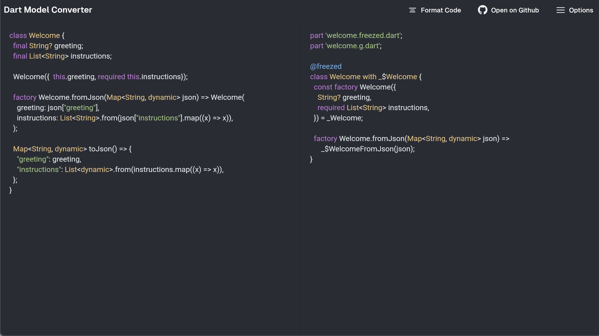

# Dart Model Converter
Transforming Dart models effortlessly, empowering your development.

## Table of Contents
- [Overview](#overview)
- [Usage](#usage)

## Support Classes

- Dart Class
- JsonSerializable
- Freezed
- Hive
- ObjectBox

## Overview

Dart Model Converter is a powerful tool designed to simplify the conversion of Dart classes.

### Why dart_model_converter ?

This project steamlines the process of model creation and serialization, making it easier for developers to manage data structures. The core features include:

- 🛠️ <b>Real-time Code Editing</b>: Provides an intuitive interface for inputting Dart class definitions with immediate conversion feedback.
- 🤝 <b>Community-Driven Development</b>: Encourages contributions, fostering collaboration and continuous improvement.

## Usage

Try [dart_model_converter](https://thitlwincoder.github.io/dart_model_converter/) in your browser.

## Contribution

Feel free to file an [issue](https://github.com/thitlwincoder/dart_model_converter/issues/new) if you find a problem or make pull requests.

All contributions are welcome :)