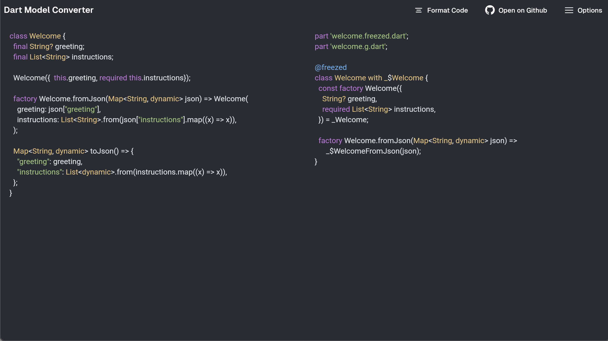

# Dart Model Converter

Dart Model Converter is a browser-based tool for converting Dart model classes between common data-modeling styles used in Flutter and Dart applications.

[](https://github.com/thitlwincoder/dart_model_converter/commits/main)
[](https://github.com/thitlwincoder/dart_model_converter/blob/main/LICENSE)
[](https://thitlwincoder.github.io/dart_model_converter/)



## Overview

Model classes often need to be rewritten when a project changes its persistence, serialization, or code-generation approach. Dart Model Converter parses an input Dart class and generates equivalent model code for another supported style.

Use it to quickly migrate or prototype models for serialization libraries, local databases, and object stores without manually rewriting constructors, fields, annotations, and JSON helpers.

## Supported formats

Dart Model Converter currently supports:

- Plain Dart classes
- `json_serializable`
- `freezed`
- Hive
- ObjectBox
- Floor
- Realm

## Features

- Parse Dart model declarations directly in the browser.
- Detect the source model style from common annotations.
- Generate formatted Dart output with `dart_style`.
- Preserve constructor parameter structure where supported.
- Preserve required, optional, and default constructor values where supported.
- Generate library-specific annotations such as primary key metadata.

## Usage

Open the web app:

[https://thitlwincoder.github.io/dart_model_converter/](https://thitlwincoder.github.io/dart_model_converter/)

Then:

1. Paste a Dart model class into the input editor.
2. Select the target output format.
3. Copy the generated Dart model code.

## Development

Install dependencies:

```sh
flutter pub get
```

Run the app locally:

```sh
flutter run
```

Run static analysis:

```sh
flutter analyze
```

Run tests:

```sh
flutter test
```

Build the web app:

```sh
flutter build web --release
```

## Contributing

Issues and pull requests are welcome.

Before opening a pull request, run:

```sh
flutter analyze
flutter test
```

Report bugs or request features in the [GitHub issue tracker](https://github.com/thitlwincoder/dart_model_converter/issues/new).

## License

This project is licensed under the [MIT License](LICENSE).
